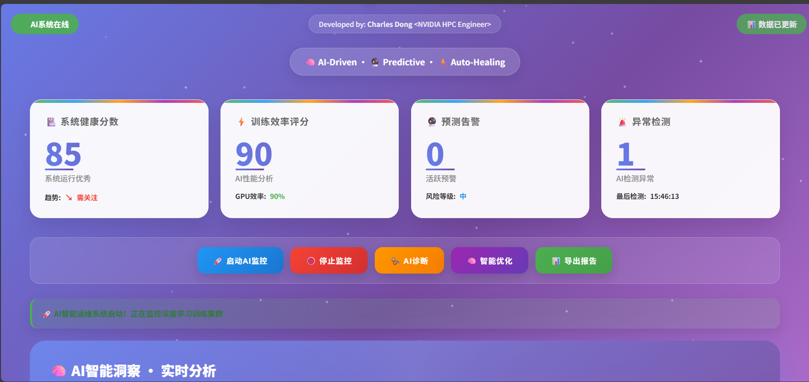
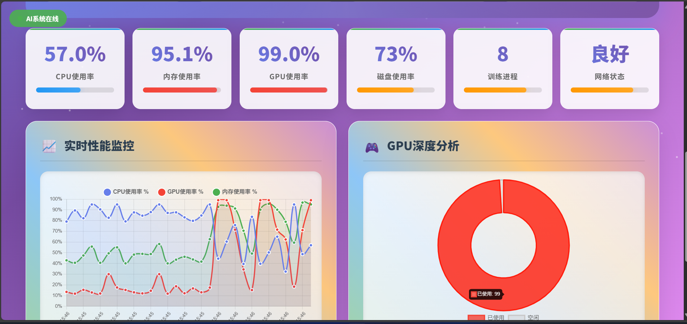

# 🚀 DLOps AI智能运维系统

**Developed by: Charles**

专为深度学习集群设计的AI驱动智能运维监控平台，支持Windows和Linux系统。

## 🚀 快速开始

### 1. 安装依赖

```bash
pip install flask numpy psutil
```

### 2. 运行方式

#### 方式A：完整系统（推荐）

```bash
# 启动监控守护进程
python dlops.py daemon start

# 启动Web界面
python dlops.py web --port 8080

# 访问: http://localhost:8080
```

#### 方式B：分离架构

```bash
# 终端1：启动监控守护进程
python dlops.py daemon start

# 终端2：启动后端API服务
python dlops_web.py

# 浏览器：打开 index.html 文件
```

### 3. 其他命令

```bash
python dlops.py daemon status     # 查看守护进程状态
python dlops.py dashboard         # 终端实时仪表板
python dlops.py check             # 运行AI诊断
python dlops.py metrics           # 查看当前指标
python dlops.py analyze           # AI系统分析
```

## 📸 界面预览

### 🎯 AI智能监控仪表板



### 📊 实时性能监控


### 🧠 AI智能洞察分析



## ✨ 核心功能

### 📊 实时监控

- **CPU/GPU/内存/磁盘** 使用率监控
- **NVIDIA GPU** 温度、功耗、显存监控
- **训练进程** 自动识别和监控
- **系统健康评分** AI综合评估

### 🧠 AI智能分析

- **异常检测** 基于统计学模型自动识别异常
- **性能预测** 预测系统性能趋势和风险
- **智能建议** AI驱动的优化建议
- **自动修复** 智能问题诊断和解决方案

### 🎛️ 多种界面

- **Web仪表板** 现代化可视化界面
- **终端仪表板** 命令行实时监控
- **RESTful API** 完整的API接口

## 🏗️ 系统架构

```
┌─────────────────┐    ┌─────────────────┐    ┌─────────────────┐
│   前端界面      │◄──►│   Web服务器     │◄──►│   监控守护进程   │
│  (index.html)   │    │ (Flask API)     │    │ (dlops daemon)  │
└─────────────────┘    └─────────────────┘    └─────────────────┘
                              │                         │
                              ▼                         ▼
                       ┌─────────────────┐    ┌─────────────────┐
                       │   AI分析引擎    │    │   系统指标采集   │
                       │ (异常检测/预测) │    │ (CPU/GPU/内存)  │
                       └─────────────────┘    └─────────────────┘
```

## 📈 API接口

### 主要端点

- `GET /api/status` - 完整系统状态
- `GET /api/metrics` - 系统指标数据
- `GET /events` - 实时数据流(EventSource)
- `POST /api/daemon/start` - 启动监控
- `POST /api/daemon/stop` - 停止监控

### 数据格式示例

```json
{
  "system": {
    "cpu_utilization": 67.5,
    "memory": "8,32,25.0",
    "disk_usage": 68
  },
  "gpu": {
    "utilization": 94.2,
    "temperature": 78,
    "memory_used": 7800,
    "memory_total": 11264
  },
  "analysis": {
    "health_score": 92,
    "issues": [],
    "recommendations": ["增加batch size优化GPU利用率"]
  }
}
```

## 🔧 配置说明

### 环境变量

```bash
export DLOPS_WORKDIR="$HOME/.dlops"  # 工作目录
export WEB_PORT=8080                 # Web端口
export DEBUG=false                   # 调试模式
```

### 文件结构

```
~/.dlops/
├── metrics/          # 指标数据
├── logs/            # 系统日志
├── diagnostics/     # 诊断报告
└── daemon.pid       # 守护进程PID
```

## 🖥️ 系统兼容性

- **Windows 10/11** ✅ 完全支持
- **Linux (Ubuntu/CentOS)** ✅ 完全支持
- **NVIDIA GPU** 🎯 专业支持
- **Python 3.7+** 📦 推荐3.8+

## 🛠️ 故障排除

### 常见问题

```bash
# 问题：守护进程无法启动
# 解决：检查端口是否被占用
python dlops.py daemon status

# 问题：GPU监控无数据
# 解决：确保安装了NVIDIA驱动和nvidia-smi

# 问题：编码错误
# 解决：确保使用修复后的代码版本
```

------

**© 2025 Charles Dong - AI-Driven Deep Learning Operations Platform**